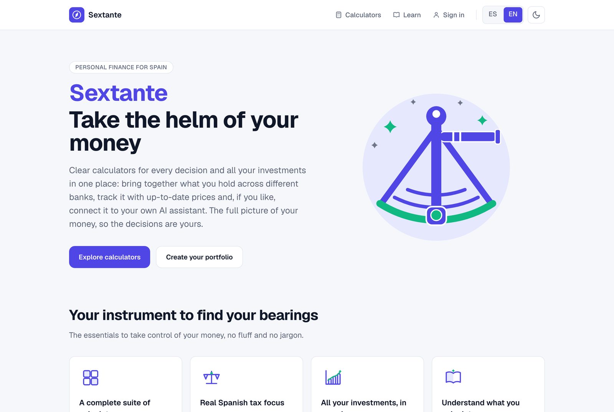
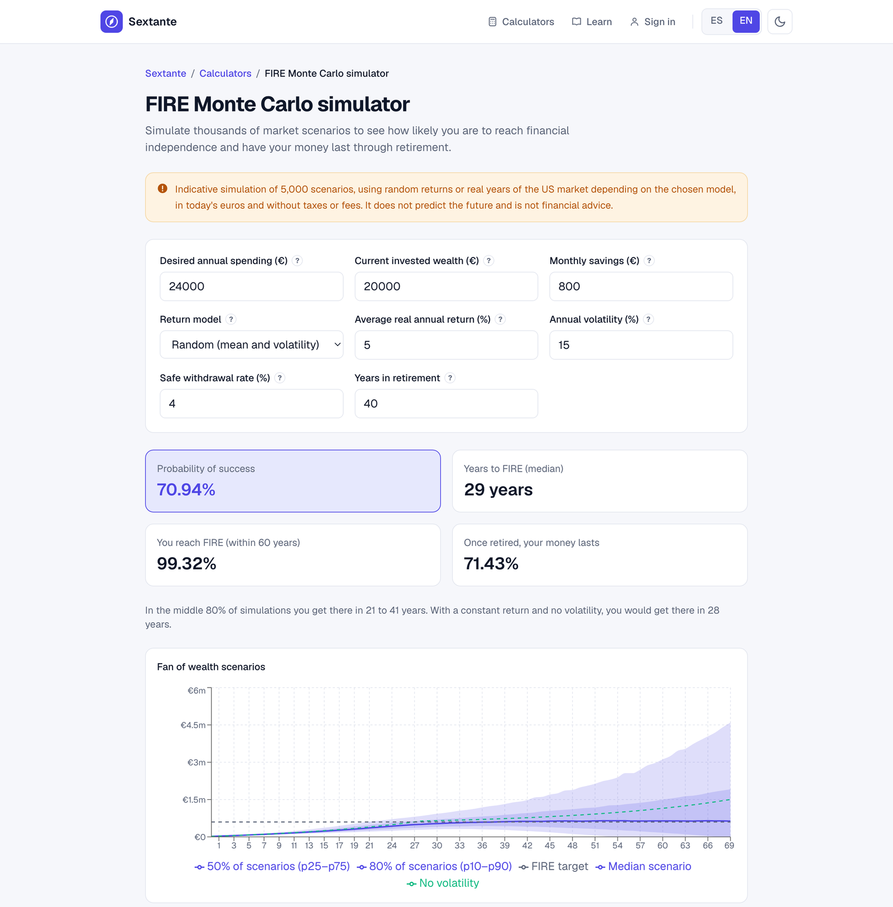
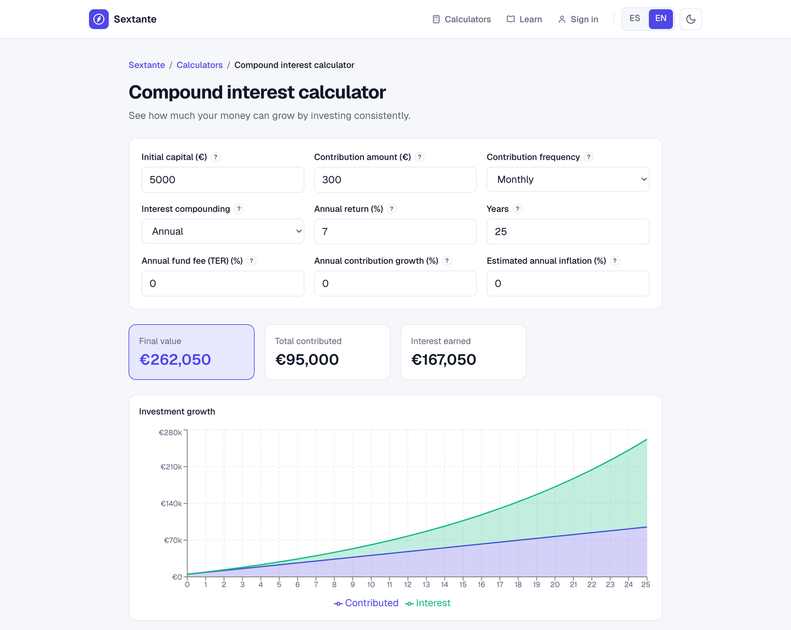
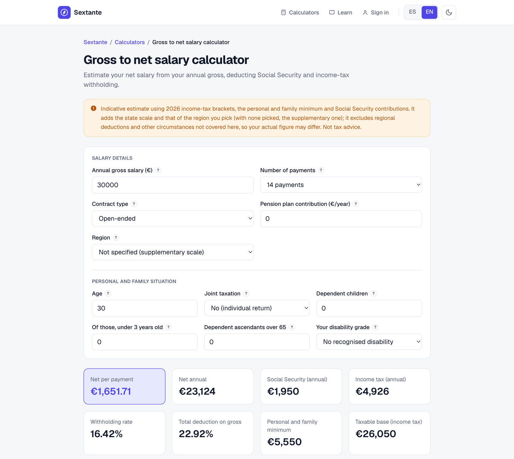
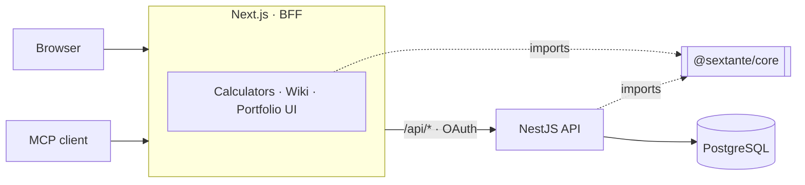

<div align="center">


# Sextante

**Personal-finance and FIRE calculators built around the Spanish tax system,<br>
plus an aggregated portfolio that your own AI assistant can read and write over MCP.**

[sextante.fpardo.net](https://sextante.fpardo.net) (Spanish) · [English](https://sextante.fpardo.net/en)

[](LICENSE)
[](https://github.com/Fedeparg/FIRE-Calculator/actions/workflows/ci.yml)
<br>


<br>

<picture>
  <source media="(prefers-color-scheme: dark)" srcset="docs/images/landing-dark.png">
  
</picture>

</div>

## Project status

Sextante is live at [sextante.fpardo.net](https://sextante.fpardo.net). The full source code is
released under the [MIT licence](LICENSE), so anyone can study it and reuse it.

> [!WARNING]
> **Not financial advice.** Sextante computes and explains; it never recommends. Every result
> is an estimate: check anything that matters with a professional and with the AEAT.

## What it does

| | |
|---|---|
| 🧮 **27 calculators** | Compound interest, FIRE with a Monte Carlo simulator over real market history, mortgages, deposits, dividends, DCA, inflation, budget… All run in the browser, need no account and keep every input in the URL. |
| 🇪🇸 **Spanish tax engine** | IRPF by the AEAT dual-scale method with the regional scale of each common-regime community, Social Security, payroll withholding, self-employed, wealth tax, gift tax and capital gains (FIFO). |
| 📈 **Aggregated portfolio** | Positions and lots across brokers, prices and FX, P&L, reconstructed history, Trade Republic import and progress towards a FIRE goal. |
| 🧾 **Tax-return report** | Savings-base figures per tax year in euros at the ECB rate, the two-month rule, dividends and interest, double-taxation credit and the box of the Spanish return (modelo 100) for each figure. |
| 🤖 **Remote MCP server** | 47 tools over Streamable HTTP with OAuth 2.1: the portfolio, the tax report, saved scenarios and every calculator, running the same `@sextante/core` code as the web. |
| 📚 **Wiki** | Articles and one explainer per calculator, in Markdown, bilingual (es/en). |

## Screenshots

<table>
  <tr>
    <td width="50%">
      <picture>
        <source media="(prefers-color-scheme: dark)" srcset="docs/images/fire-dark.png">
        
      </picture>
      <p align="center"><sub><b>FIRE Monte Carlo simulator</b>: 5,000 market scenarios</sub></p>
    </td>
    <td width="50%">
      <picture>
        <source media="(prefers-color-scheme: dark)" srcset="docs/images/compound-dark.png">
        
      </picture>
      <p align="center"><sub><b>Compound interest</b>: contributions vs. interest over time</sub></p>
    </td>
  </tr>
  <tr>
    <td colspan="2">
      <picture>
        <source media="(prefers-color-scheme: dark)" srcset="docs/images/salary-dark.png">
        
      </picture>
      <p align="center"><sub><b>Gross to net salary</b>: Social Security, IRPF withholding and the personal and family minimum</sub></p>
    </td>
  </tr>
</table>

<p align="center"><sub>Screenshots follow your GitHub theme: switch between light and dark to see both.</sub></p>

## Architecture

A pnpm workspace with three packages that deploy as one stack:

| Path | What |
|---|---|
| `/` (root) | Next.js frontend (App Router) and BFF: `rewrites()` proxy `/api/*` and the OAuth routes to the API, so the browser only ever talks to one origin |
| `apps/api` | NestJS + Drizzle + PostgreSQL. Single source of truth for data and identity |
| `packages/core` | `@sextante/core`: pure logic shared by both (calculators, projection engine, tax engine, FX, portfolio breakdown and goal) |



The calculators and the wiki work with the frontend alone; the API is needed for sign-in, the
portfolio and MCP.

## Running it locally

Requirements: Node 24 (see `.nvmrc`; 22.13 is the minimum), [pnpm](https://pnpm.io/) and
Docker (for the API stack and the backend tests).

```bash
pnpm install
cp .env.example .env                     # frontend
pnpm dev                                 # http://localhost:3000

# Optional, for sign-in / portfolio / MCP:
cp apps/api/.env.example apps/api/.env
docker compose up -d --build             # postgres + one-shot migrate + api (:3001)
```

Day-to-day commands (each package is checked on its own; CI runs all of them):

| Frontend (root) | Backend |
|---|---|
| `pnpm typecheck` · `pnpm lint` | `pnpm --filter @sextante/api typecheck` · `lint` |
| `pnpm test` · `pnpm test <path>` | `pnpm --filter @sextante/api test` (needs Docker) |
| `pnpm build` | `pnpm --filter @sextante/api build` |

Backend details (modules, migrations, tests): [`apps/api/README.md`](apps/api/README.md).
Self-hosting with Docker Compose, secrets, encrypted backups and analytics:
[`docs/DEPLOY.md`](docs/DEPLOY.md). What was built and what was decided not to build:
[`ROADMAP.md`](ROADMAP.md).

## License

[MIT](LICENSE) © 2026 Federico Pardo García.
