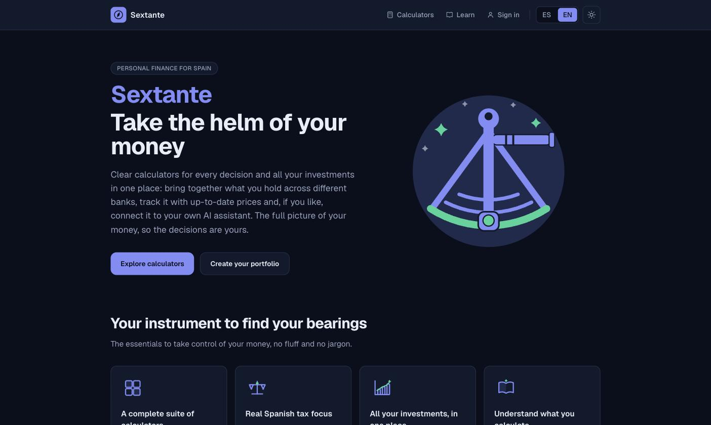
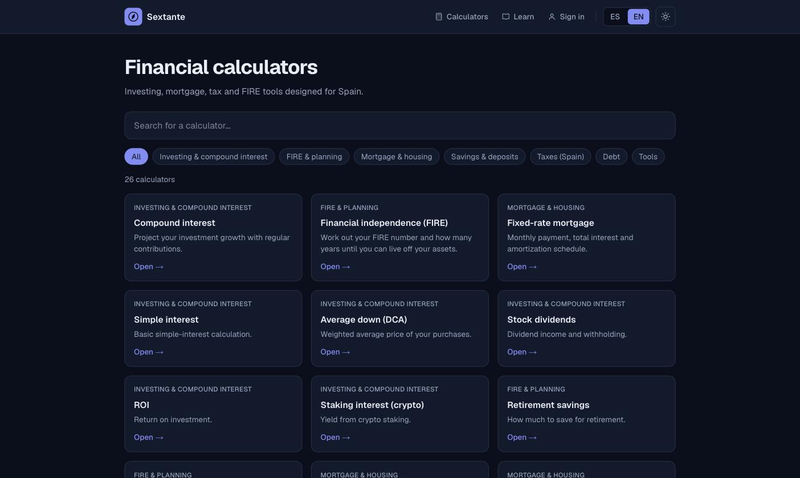
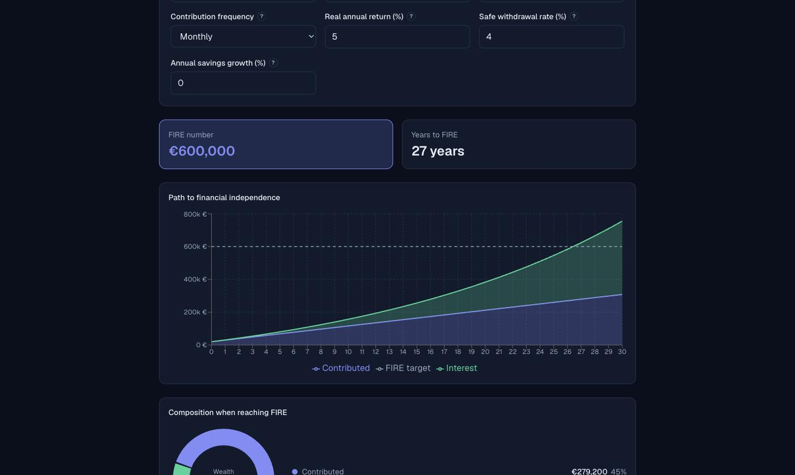
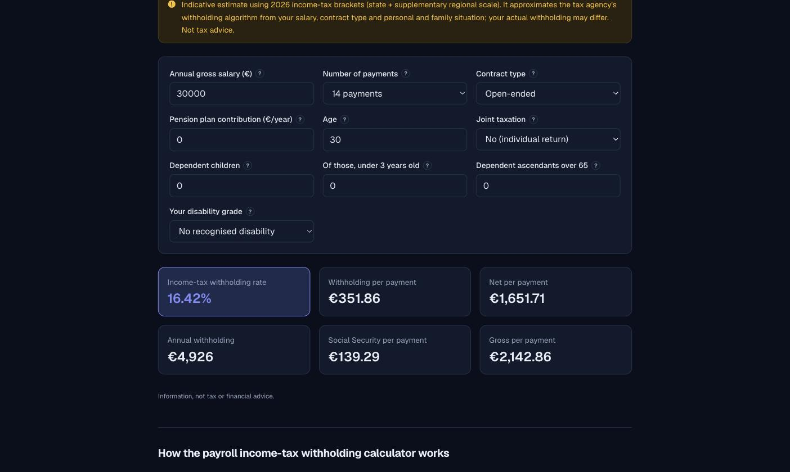
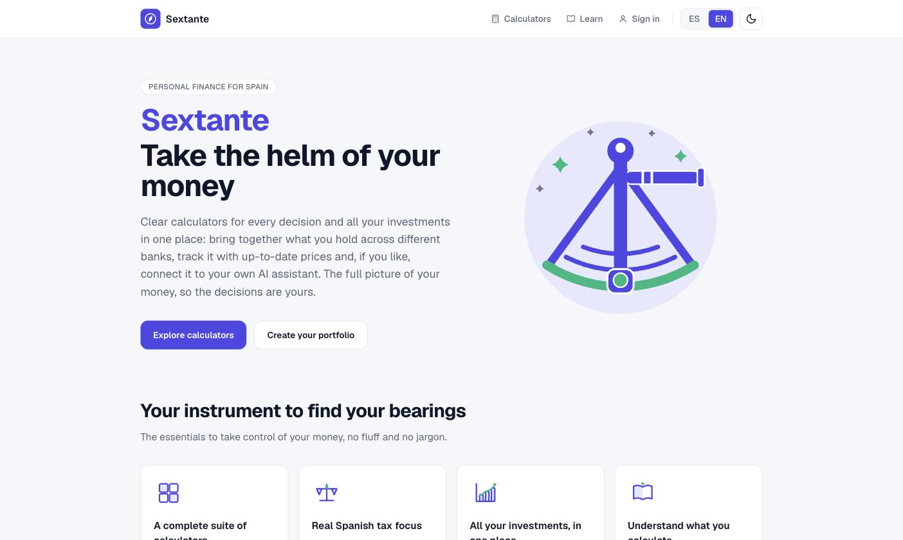
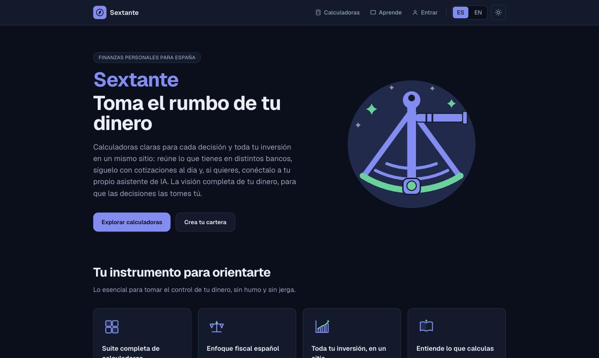
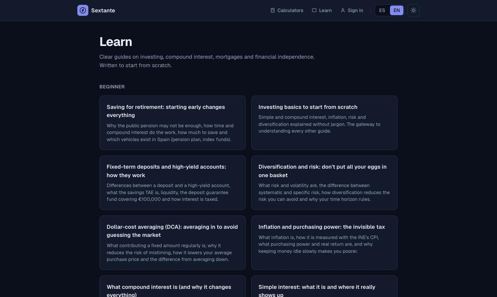
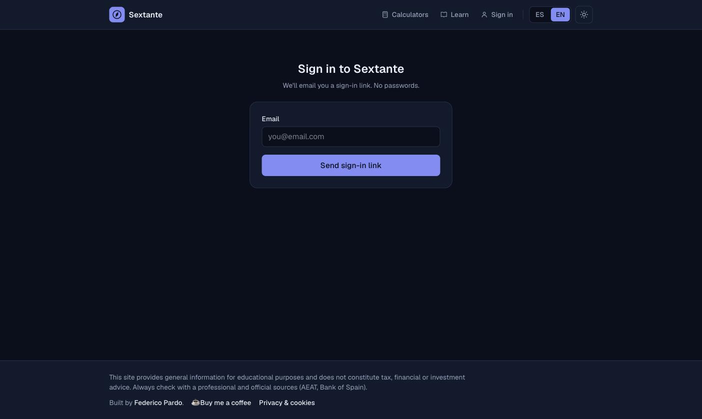
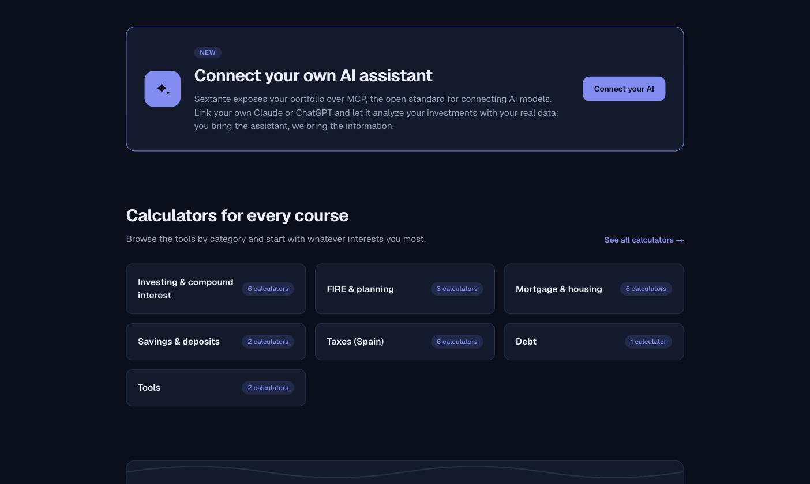

<div align="center">

# Sextante

**Personal-finance and FIRE calculators built around the Spanish tax system — plus an aggregated portfolio your own AI assistant can read and write over MCP.**

[](https://github.com/Fedeparg/sextante/actions/workflows/ci.yml)
[](LICENSE)
[](https://nextjs.org/)
[](https://nestjs.com/)
[](https://www.postgresql.org/)
[](#connect-your-own-ai-assistant-mcp)
[](#built-with-ai-assistance)

**[sextante.fpardo.net](https://sextante.fpardo.net)** · [Español](https://sextante.fpardo.net) · [English](https://sextante.fpardo.net/en)



</div>

---

## Contents

- [What this is](#what-this-is)
- [Screenshots](#screenshots)
- [Architecture](#architecture)
- [Technical decisions](#technical-decisions)
- [Connect your own AI assistant (MCP)](#connect-your-own-ai-assistant-mcp)
- [The Spanish tax engine](#the-spanish-tax-engine)
- [Quality and testing](#quality-and-testing)
- [Running it locally](#running-it-locally)
- [Deployment](#deployment)
- [Project structure](#project-structure)
- [Built with AI assistance](#built-with-ai-assistance)
- [License](#license)

---

## What this is

A *sextant* is the instrument you use to find your position when there are no
landmarks. That's the idea: give people the numbers, clearly, and let them make
their own decisions.

Most Spanish finance calculators are either ad-choked SEO farms or generic
international tools that quietly assume a US tax code. Sextante is neither. It's a
single, coherent suite where the maths is auditable, the tax rules are actually
Spanish, and every calculator runs in your browser — no account needed.

| | |
|---|---|
| **26 calculators** | Compound interest, FIRE, mortgages (fixed rate / early repayment / buy-vs-rent / affordability), deposits, dividends, DCA, staking, inflation, ROI, budget, financial-health quiz… |
| **A real Spanish tax engine** | IRPF via the AEAT dual-scale method, with the regional scale of each of the 15 common-regime communities, Social Security contributions with caps, payroll withholding, self-employed IRPF, wealth tax, gift tax by kinship group |
| **Aggregated portfolio** | Positions across brokers in one place, with a daily price feed, FX conversion and P&L |
| **Portfolio history** | Purchase lots per position, a year of prices fetched the first time a symbol is seen, nightly valuation snapshots, an evolution chart and a breakdown by asset, broker or currency |
| **Capital-gains simulator** | "What if I sell?" with FIFO lot matching, fees prorated across the shares still open, and an estimate on the savings scale — upfront about the rules it does not model |
| **Shareable and saveable** | Every input lives in the URL, so a calculation is a link; signed in, you can save named scenarios to your account |
| **Your goal, your real money** | The portfolio tracks progress towards your financial-independence target using the net worth you actually hold, sharing saved scenarios with the FIRE calculator |
| **MCP server** | Connect Claude, ChatGPT or any MCP client and let it read *and* write your portfolio — you bring the model, Sextante brings the data |
| **Bilingual** | Spanish (default) and English: 1,065 translation keys per locale, with parity enforced by a test, not by hope |
| **A wiki** | 30 explainer articles plus a "how this calculator works" page for each of the 26 tools, in both languages |
| **No tracking** | No analytics, no ads, no third-party scripts. The CSP allowlist is `'self'` and nothing else. |

> **Not financial advice.** Sextante computes and explains; it never recommends.
> Every result is an estimate, and the tax pages say plainly where they
> approximate. Check anything that matters with a professional and with the AEAT.

---

## Screenshots

### Calculator index — searchable, categorised, all 26 in one place



### A calculator: FIRE

Inputs on top, headline numbers as stat tiles, then the charts. Every calculator
that projects investments over time shares one engine, so the shapes and colours
mean the same thing everywhere.



### A calculator: IRPF payroll withholding

This is what "focused on the Spanish system" means in practice — contract type,
number of payments per year, dependent children under three, dependants over 65,
recognised disability, joint taxation. Plus a visible, honest note about what the
model approximates.



### Light and dark, both first-class

Both themes are required to work at all times; colours come from CSS variables in
`globals.css` and nothing is hardcoded. The theme is applied before paint, so
there's no flash on load.



### Fully bilingual

Every screenshot above is the English build. Here's the same landing page in
Spanish — and it isn't just strings: number and currency formatting follow the
locale too.



### The wiki



### Passwordless sign-in



---

## Architecture

A pnpm workspace with two packages that deploy as one stack.

```
                    ┌───────────────────────────────────────────┐
  browser ─────────▶│  web · Next.js 16 (App Router)            │
  (always           │                                           │
   same-origin)     │  • calculators run HERE, in the browser   │
                    │  • BFF: rewrites /api/* ───────────┐      │
                    │  • reads the session cookie and    │      │
                    │    validates it against the API    │      │
                    └────────────────────────────────────┼──────┘
                                                         │
  MCP client ────────────────────────────────────────────┤
  (Claude, ChatGPT)   OAuth 2.1 + POST /api/mcp           │
                                                         ▼
                    ┌───────────────────────────────────────────┐
                    │  api · NestJS 12                          │
                    │                                           │
                    │  auth · positions · prices · portfolio    │
                    │  oauth · mcp · account · donations        │
                    │                                           │
                    │  Drizzle ORM ──▶ PostgreSQL 17            │
                    └───────────────────────────────────────────┘
```

**The API is the single source of truth for data and identity.** Next.js never
talks to the database. It renders, it holds the calculation engine, and it acts as
a Backend-for-Frontend that proxies `/api/*` to NestJS — so the browser only ever
speaks to one origin, in development and in production alike. No CORS, no
cross-site cookie problems, no separate API domain to configure.

Authorization is always decided server-side: `src/lib/session.ts` is `server-only`
and validates the session cookie against `/api/auth/me` rather than trusting
anything the client claims.

---

## Technical decisions

The interesting part of any codebase is the *why*. Here are the calls worth
explaining, including the ones with real trade-offs.

### The calculation engine is pure, framework-free TypeScript

`src/core/` has no React import anywhere. It's plain functions over plain data:
`projection.ts` is a generic investment-projection engine, `fiscal/` is the tax
engine, `calculators/*.ts` are thin wrappers, `format.ts` handles locale-aware
formatting.

**Why:** it makes the maths trivially testable — 248 unit tests run in under a
second with no DOM and no renderer — and it stops ~25 calculator modules from each
reimplementing compounding. Every investment calculator delegates to
`projection.ts`, so a bug fixed in periodic contributions is fixed everywhere at
once.

**Consequence:** the calculators run *in the browser*, which is exactly why the MCP
server deliberately doesn't expose them ([see below](#what-mcp-does-not-expose)).

### Same-origin BFF instead of a separate API domain

Next's `rewrites()` proxies `/api/*` to NestJS — `localhost:3001` in development,
the internal Compose service `http://api:3001` in production.

**Why:** the session lives in an `HttpOnly`, `SameSite` cookie. Talking to a second
origin would mean CORS preflights, `SameSite=None`, and a much larger surface for
getting cookie security subtly wrong. This way dev and prod have identical origin
semantics, so a whole class of "works locally, breaks in prod" bugs can't happen.

### CSP is an allowlist, not a nonce — deliberately

`script-src` uses `'unsafe-inline'`. That's normally a smell, so here's the
reasoning: a nonce-based CSP needs a fresh nonce per response, which forces
**every page to render per request** and destroys static generation and ISR for the
calculators and the wiki. Since the app loads *zero* third-party scripts and
strips embedded HTML from Markdown before injecting it, the allowlist buys most of
the protection at none of the cost. The trade-off is written down in
`next.config.ts`, next to the code.

Everything else is tightened to match: `default-src 'self'`, `object-src 'none'`,
`img-src 'self' data:`, plus HSTS, `nosniff`, `X-Frame-Options`, a referrer policy
and a permissions policy.

### Passwordless auth

Magic link only — there are no passwords to leak, reset or reuse. The emailed
token is stored **hashed** (SHA-256), redeemed atomically so it's genuinely
single-use, and exchanged for a JWT held in an `HttpOnly` cookie.

### Content is Markdown on disk, not rows in a database

The wiki and the legal pages are `content/**/*.md`, translated by filename suffix
(`<slug>.es.md` / `<slug>.en.md`) and rendered through unified/remark with ISR.
Adding an article means adding two files — no code, no migration, no CMS.

### Prices pivot through USD

Every quote and FX rate is fetched against USD and pivoted through it, instead of
storing an N×N matrix of currency pairs. Positions in EUR, USD or GBP aggregate
into one display currency; anything without a price or a convertible currency is
**excluded from the total and flagged**, rather than silently counted as zero.

### Mobile numeric inputs are `type="text"`

`<input type="number">` is hostile on Spanish phone keyboards: it rejects the
comma decimal separator the locale actually uses. Every numeric field is
`type="text"` with `inputMode="decimal"`, parsed by `src/core/number-input.ts`.

### Non-finite results render as "—"

Division by zero, `NaN`, `Infinity`. A finance tool that shows `NaN €` destroys
trust instantly, so `format.ts` funnels every non-finite value to an em dash.

### Translations are enforced, not hoped for

No UI string is ever hardcoded in a component; everything goes through
`next-intl`. `messages/es.json` and `messages/en.json` are held at **exactly the
same key set** (1,065 each) with the same ICU arguments — and a test fails the
build if they ever drift, so this is checked, not assumed.

---

## Connect your own AI assistant (MCP)



Sextante exposes a **remote MCP server** so an LLM you already pay for can work
with your portfolio. You bring the assistant; Sextante brings the data.

```
https://sextante.fpardo.net/api/mcp
```

Transport is **Streamable HTTP** (`POST /api/mcp`); auth is **OAuth 2.1**, the MCP
standard — not personal access tokens.

### The tools

| Tool | Scope | What it does |
|---|---|---|
| `list_positions` | `portfolio:read` | Every position: symbol, name, quantity, average price, broker, currency |
| `get_portfolio_valuation` | `portfolio:read` | Market value and P&L, aggregated into a display currency, with a per-position breakdown |
| `get_position` | `portfolio:read` | One position by id, with its market value and P&L |
| `add_position` | `portfolio:write` | Create a position |
| `update_position` | `portfolio:write` | Patch the given fields of a position |
| `combine_position` | `portfolio:write` | Merge a new purchase into an existing position by weighted average |
| `delete_position` | `portfolio:write` | Remove a position (annotated `destructiveHint`) |

Write tools validate their input with the **same DTOs as the REST API**, so there
is one set of validation rules, not two.

### Why the SDK's own authorization server

The obvious move was `node-oidc-provider`. It was evaluated and **rejected**: it
would have meant running two parallel identity systems, since the app already has
magic-link auth with its own token discipline.

Instead the Authorization Server comes from `@modelcontextprotocol/sdk` itself
(`mcpAuthRouter`, the `OAuthServerProvider` interface, `requireBearerAuth`). The
accepted trade-off is that the SDK doesn't mint tokens — so Sextante mints them,
reusing the patterns already proven in `auth.service`: SHA-256 hashing, atomic
single-use redemption, TTLs. PKCE validation is left to the SDK
(`skipLocalPkceValidation` stays `false`).

### Four barriers against data leaking between users

This is the part that actually matters when an external model holds a token to
someone's finances.

1. **The `userId` lives inside the token**, and every tool filters by it. There is
   no code path where a tool accepts a user id as a parameter.
2. **Audience binding (RFC 8707)**, enforced in `verifyAccessToken`: a token whose
   audience isn't `…/api/mcp` is rejected, so a token minted for something else
   can't be replayed here.
3. **Tokens and authorization codes are only ever stored hashed.** A database dump
   yields nothing usable.
4. **Per-client consent, revocation, cascade delete and an audit log.** *My account
   → Connected apps* lists every client, and revoking one takes effect immediately.
   Deleting your account cascades through grants and tokens.

### Per-tool scope step-up

Write tools are always *registered*, so clients can discover them — but each one
re-checks its scope at call time. A read-only token calling `add_position` gets a
**tool-level error** telling it to reconnect with write permission, plus a
`denied_scope` entry in the audit log.

Why not HTTP 403? Because every MCP tool shares a single endpoint. Authorization
has to be per-tool, or it isn't authorization at all.

### What MCP does *not* expose

**The calculators.** Exposing them would mean duplicating `projection.ts`, ~25
calculator modules and the entire tax engine in the backend — because the engine
lives in the frontend `core/` and runs in the user's browser, where it can be
audited. Two copies of a tax engine drift apart. The gain didn't justify the cost,
so it was cut on purpose.

---

## The Spanish tax engine

`src/core/fiscal/` is the part that's hardest to get right and easiest to get
subtly wrong, so it's isolated, pure and heavily tested.

- **IRPF** by the AEAT **dual-scale method** — tax on the base minus tax on the
  personal and family minimum, rather than a naive bracket sweep.
- **Personal and family minimums**: age bands, dependent children (with the
  under-three uplift), dependants over 65, recognised disability at 33% and 65%,
  and the joint-taxation reduction.
- **Social Security** employee contributions, including the different rate for
  temporary contracts and the annual contribution ceiling.
- **Wealth tax** and **gift tax**, with kinship groups and the statutory
  pre-existing-wealth multipliers.
- **Self-employed** IRPF and contributions.

**Stated limitations, in the code and in the UI:** the engine assumes the
*supplementary state scale* for the regional half of IRPF. Real regional scales and
region-specific deductions vary, so the figure is an approximation — and the
calculators say so on the page, not in a footnote.

---

## Quality and testing

```
✔ pnpm typecheck    tsc --noEmit · strict · no `any`
✔ pnpm lint         eslint
✔ pnpm test         31 test files · 248 tests passing
```

CI (`.github/workflows/ci.yml`) runs typecheck, lint, tests **and** a full build
for *both* packages on every push and pull request, on GitHub-hosted runners.

The backend has its own Vitest suite covering the JWT guard, the OAuth provider,
portfolio valuation and the positions service. It spins up a **real, ephemeral
PostgreSQL** with [Testcontainers](https://testcontainers.com/) instead of mocking
the database, so the tests exercise actual SQL, actual constraints and actual
Drizzle behaviour. That's why they need a Docker daemon.

Every core module containing logic has a `.test.ts` sibling. Standard *and* edge
cases are required: zero rates, zero years, non-finite results, currency
mismatches, and boundary values at every tax bracket.

---

## Running it locally

**Requirements:** Node 24 (see `.nvmrc`; 22.13 is the minimum), [pnpm](https://pnpm.io/),
and Docker if you want the API or the backend tests.

```bash
pnpm install

cp .env.example .env                     # frontend
cp apps/api/.env.example apps/api/.env   # backend (only if you need the API)

pnpm dev                                 # frontend → http://localhost:3000
pnpm --filter @sextante/api dev          # backend  → http://localhost:3001
```

The calculators and the wiki work with the frontend alone — no database, no
account. The API is only needed for sign-in, the portfolio and MCP.

**Full stack in Docker:**

```bash
docker compose up   # postgres + one-shot migrate + api
```

### Commands

| Frontend (root) | Backend (`apps/api`) |
|---|---|
| `pnpm dev` | `pnpm --filter @sextante/api dev` |
| `pnpm build` · `pnpm start` | `pnpm --filter @sextante/api build` |
| `pnpm test` · `pnpm test:watch` | `pnpm --filter @sextante/api test` *(needs Docker)* |
| `pnpm typecheck` · `pnpm lint` | `pnpm --filter @sextante/api typecheck` · `lint` |
| | `pnpm --filter @sextante/api db:generate` · `db:migrate` · `db:studio` |

Run a single test file with `pnpm test src/core/fiscal/irpf.test.ts`, or filter by
name with `pnpm test -t "IRPF"`.

`apps/` is excluded from the root tooling (`tsconfig` `exclude`, eslint ignore) —
each package is checked on its own.

---

## Deployment

Self-hosted: Docker Compose, PostgreSQL on a persistent volume, a one-shot
migration service, and a reverse proxy terminating TLS. A push to `main` triggers
`.github/workflows/deploy.yml`.

Backups run `pg_dump → gzip → gpg (AES256) → rclone` on a daily schedule with
rotation. **Encryption happens on the server**, so the storage provider only ever
receives an opaque `.gpg` — which is also what stops that provider from becoming a
GDPR sub-processor of personal data.

Full instructions in **[`docs/DEPLOY.md`](docs/DEPLOY.md)**.

> ⚠️ **If you fork this and deploy it, read the warning at the top of
> [`docs/DEPLOY.md`](docs/DEPLOY.md) before enabling a self-hosted runner on a
> public repo.** On a `pull_request` event GitHub runs the workflows *from the PR
> branch*, so anyone can open a fork PR carrying a workflow that claims your
> runner. The document covers both the pull-based alternative and how to harden
> the runner if you keep it.

---

## Project structure

```
src/                        Frontend (Next.js)
  app/[locale]/             Routes — i18n prefix `as-needed` (es bare, en under /en)
  app/og/                   Dynamic Open Graph image generation
  core/                     Pure logic. No React. Fully tested.
    projection.ts             Generic investment-projection engine
    fiscal/                   Spanish tax engine (IRPF, brackets, Social Security)
    calculators/              One module per calculator — thin wrappers over core
    registry.ts               Calculator catalogue (feeds the searchable index)
    format.ts                 Locale-aware number and currency formatting
  components/
    ui/                       Primitives (NumberField, SelectField, Stat, …)
    charts/                   Reusable Recharts wrappers
    calculators/              One UI per calculator (most share CalculatorLayout)
  lib/                      Server helpers: session, SEO, JSON-LD, site config
  i18n/                     next-intl configuration

apps/api/                   Backend (NestJS)
  src/db/                   Drizzle schema (source of truth) + migration runner
  src/auth/                 Magic link, JWT, session
  src/oauth/                OAuth 2.1 authorization server for MCP
  src/mcp/                  Remote MCP server + audit log
  src/positions/            Portfolio CRUD
  src/prices/               Quote feed, FX rates, ISIN/ticker resolution
  src/portfolio/            Valuation and P&L
  src/account/              GDPR: export, deletion, connected apps
  drizzle/                  Versioned SQL migrations

content/                    Wiki and legal pages in Markdown (i18n by filename)
messages/                   es.json / en.json — key parity enforced
docs/                       Deployment, nginx example, screenshots
```

---

## Built with AI assistance

**Sextante was built with heavy assistance from [Claude Code](https://claude.com/claude-code),
Anthropic's agentic coding tool.** A large share of the code, tests, translations
and wiki articles here were written by an AI agent working from my direction.

I'm stating this plainly because I think it's the honest thing to do, and because
for a tool that computes people's taxes, provenance is part of the trust story.

**What that split actually looked like:**

- **I decided** the product, the architecture, and every call in the
  [Technical decisions](#technical-decisions) section — the pure `core/`, the
  same-origin BFF, the CSP-versus-ISR trade-off, using the MCP SDK's own
  authorization server, not exposing calculators over MCP. The tax rules and their
  documented limitations are mine to answer for.
- **The agent did** a lot of the implementation, the test suites, the bilingual
  message files, the wiki content, and the repetitive work of keeping ~25
  calculators consistent with one another.
- **Everything was reviewed before it landed.** The repo has a `CLAUDE.md` with
  the standards the agent has to meet: strict typing, no `any`, no hardcoded UI
  strings, both themes working, tests for standard *and* edge cases.

**What keeps it honest rather than plausible-looking:** the calculation engine is
pure and dependency-free, so you can read it top to bottom; 248 unit tests pin the
maths down, including boundary values at every tax bracket; CI gates typecheck,
lint, tests and build on both packages; and where the tax model approximates, it
says so in the code *and* on the page.

If you find a number that's wrong, that's on me, not the tooling. Please
[open an issue](https://github.com/Fedeparg/sextante/issues).

---

## License

[**GNU AGPL-3.0**](LICENSE).

You're free to use, study, modify and redistribute this. If you run a modified
version as a network service, section 13 requires you to offer its source to your
users. That's deliberate: the whole point of publishing a tool that computes
people's taxes is that anyone can check the maths.

Security issues: please see [`SECURITY.md`](SECURITY.md) rather than opening a
public issue.

---

<div align="center">

Built by [Federico Pardo](https://fpardo.net) · [sextante.fpardo.net](https://sextante.fpardo.net)

*Information, not advice.*

</div>
